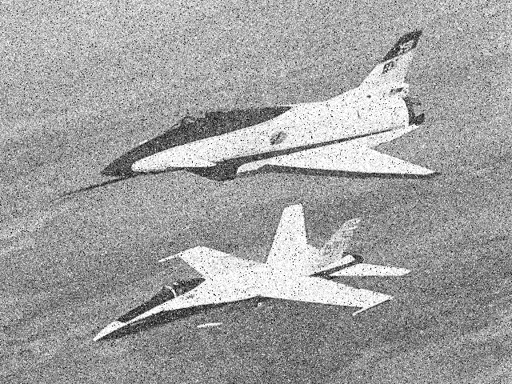
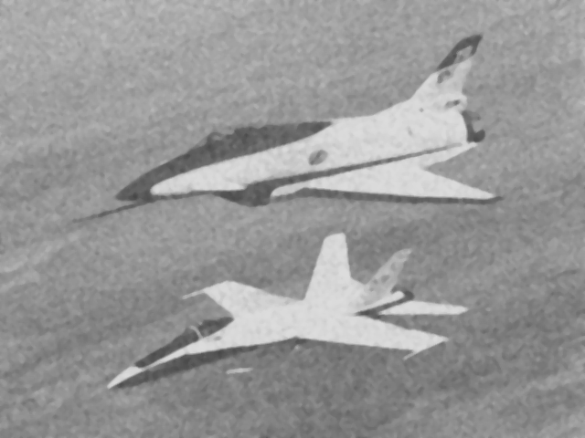

- [How to use](#orge77cabb)
- [Real example](#org9d0b65a)
- [Histogram equalization](#orgdf7b2a4)
- [Intensity transformations](#orgd80e46d)
- [Spatial filters](#org29c5aed)
- [Textures](#org3141087)
- [Image mapping functions](#org2ef0c6b)
- [Auxiliary functions](#org78db174)


<a id="orge77cabb"></a>

# How to use

```lisp
(img-transform "img/screws" "-equal.pgm" (img-transf-hist-equal "img/screws"))
(img-transform "img/pepper" "-neg.pgm" (img-transf-negative 255))
(img-transform "img/relogio" "-gamma.pgm" (img-transf-gamma 255 0.3))
(img-transform "img/mountain" "-contrast.pgm" (img-transf-contrast-stretching 255 0.6 0 0.6 1))
(img-transform "img/mona" "-log.pgm" (img-transf-log 255))
(img-transform-mask "img/monalisa" "-median.pgm" #'median 3 3)
(img-transform-mask "img/pepper" "-high-pass.pgm" (img-define-mask '(-1 -1 -1
								     -1 8 -1
								     -1 -1 -1))
		    3 3 t)
(img-transform-mask "img/monalisa" "-gaussian.pgm"
		    (img-define-mask (img--gaussian-filter 1.3 5 5)) 5 5)

(img-texture "img/mountain" (lambda (i j)
			      (list (1+ i) (1+ j))))
```


<a id="org9d0b65a"></a>

# Real example

This is an image with gaussian and salt and pepper noise:



This is the result after applying the median, mean and gaussian filters, then using a high-pass filter to detect edges and adding it with an weight of 0.25 to the result of the previous low pass filters and finally applying one last median filter.



```lisp
(img-transform-mask "img/noise" "2.pgm" #'median 3 3)
(img-transform-mask "img/noise2" "3.pgm" #'mean 3 3)
(img-transform-mask "img/noise23" "5.pgm"
		    (img-define-mask (img--gaussian-filter 1 5 5)) 5 5)
;; Edge detection with high pass filter:
(img-transform-mask "img/noise23" "4.pgm" (img-define-mask '(-1 -1 -1
							     -1 8 -1
							     -1 -1 -1))
		    3 3 t)
;; This is a lisp hacky way (I'll improve it later ...) to add the high pass filter
;; with an weight of 0.25 to the result of the previous low pass filters:
(img-transform "img/noise235"
	       "6.pgm"
	       (let* ((i -1)
		      (k 0.75)
		      (file-words (read-file-words
				   (concatenate 'string "img/noise234" ".pgm")))
		      (img-type (first file-words))
		      (width (parse-integer (second file-words)))
		      (height (parse-integer (third file-words)))
		      (max-level (parse-integer (fourth file-words)))
		      (pixels-arr (list-to-matrix (list
						   (mapcar #'parse-integer
							   (nthcdr 4 file-words))))))
		 (lambda (x)
		   (setf i (1+ i))
		   (round (+ (* k x)
			     (* (- 1 k) (aref pixels-arr 0 i)))))))
(img-transform-mask "img/noise2356" "7.pgm" #'median 5 5)
```


<a id="orgdf7b2a4"></a>

# Histogram equalization

```lisp
(defun write-histogram-to-file (filename extension hist)
  "Write the histogram values as a single column to a file."
  (with-open-file (out (concatenate 'string filename extension)
		       :direction :output
		       :if-exists :supersede)
    (format out "~{~a~%~}" hist)))

(defun img-calc-hist (max-level pixels-mat)
  "Calculate the histogram of an image."
  (loop for level from 0 to max-level
	collect (count level pixels-mat)))

(defun img-norm-hist (hist num-pixels)
  "Normalize a histogram."
  (mapcar (lambda (x)
	    (/ x num-pixels))
	  hist))

(defun img-calc-cdf (hist-norm)
  "Calculate the CDF using a normalized histogram."
  (let ((sum 0))
    (loop for prob in hist-norm
	  collect (setq sum (+ sum prob)))))


(defun img-calc-hist-equal-alist (max-level cdf)
  "Return an alist for histogram equalization with (OLD-VALUE NEW-VALUE)
elements."
  (let ((i -1))
    (mapcar (lambda (x)
	      (setf i (1+ i))
	      `(,i ,(ceiling (* x max-level))))
	    cdf)))

(defun img-transf-hist-equal (filename)
  "Return a transformation T(X) = c*(offset + X)^gamma."
  (let* ((file-words (read-file-words
		      (concatenate 'string filename ".pgm")))
	 (width (parse-integer (second file-words)))
	 (height (parse-integer (third file-words)))
	 (num-pixels (* width height))
	 (max-level (parse-integer (fourth file-words)))
	 (pixels-mat (mapcar #'parse-integer (nthcdr 4 file-words)))

	 (hist (img-calc-hist max-level pixels-mat))
	 (hist-norm (img-norm-hist hist num-pixels))
	 (cdf (img-calc-cdf hist-norm))
	 (hist-old-new-alist (img-calc-hist-equal-alist max-level cdf)))

    (lambda (x)
      (second (assoc x hist-old-new-alist)))))
```


<a id="orgd80e46d"></a>

# Intensity transformations

```lisp
(defun img-transf-negative (max-level)
  "Return a transformation T(X) = max-level - X."
  (lambda (x) (- max-level x)))

(defun img-transf-log (max-level)
  "Return a transformation T(X) = c*log(1 + X)."
  (lambda (x) (ceiling (* max-level
			  (/ (log (1+ x) 10)
			     (log (1+ max-level) 10))))))

(defun img-transf-gamma (max-level gamma &optional (offset 0))
  "Return a transformation T(X) = c*(offset + X)^gamma."
  (lambda (x) (ceiling (* max-level
			  (/ (expt (+ offset x) gamma)
			     (expt (+ offset max-level) gamma))))))

(defun img-transf-contrast-stretching (max-level a b c d)
  "Return a transformation T(X) using (a b) (c d). "
  (lambda (x)
    (setf x (/ x max-level))
    (ceiling (* max-level (cond ((<= x a)
				 (* b x))
				((and (> x a) (< x c))
				 (let* ((delta (/ (- d b) (- c a)))
					(k (- b (* delta a))))

				   (+ k (* delta x))))
				(t
				 (let* ((delta (/ (- 1 d) (- 1 c)))
					(k (- 1 delta)))
				   (+ k (* delta x)))))))))
```


<a id="org29c5aed"></a>

# Spatial filters

```lisp
(defun mean (&rest numbers)
  "Returns the mean of numbers."
  (/ (apply #'+ numbers)
     (length numbers)))

(defun mode (&rest numbers)
  "Returns the mode of numbers. TODO: rewrite this function."
  (let ((uniques (remove-duplicates numbers)))
    (first (first (sort (loop for i in uniques
			      collect (list i (loop for j in numbers
						    count (= i j))))
			(lambda (x y) (> (second x)
					 (second y))))))))

(defun median (&rest numbers)
  "Returns the median of numbers."
  (let* ((sorted (funcall (lambda (x) (sort x #'<)) numbers))
	 (list-size (length sorted))
	 (middle (nthcdr (1- (ceiling (/ list-size 2))) sorted)))
    (if (= 0 (mod list-size 2))
	(/ (+ (first middle) (second middle)) 2)
	(first middle))))

(defun img--gaussian-filter (std m n)
  "Returns a m by n gaussian mask. m and n must be odd."
  (let* ((orig-i (/ (1- m) 2))
	 (orig-j (/ (1- n) 2))
	 (var (* std std)))
    (loop for i from 0 below m
	  nconc (loop for j from 0 below n
		      for dist-i = (abs (- i orig-i))
		      for dist-j = (abs (- j orig-j))
		      collect (* (/ 1 (* 2 pi var))
				 (exp (- (/ (+ (* dist-i dist-i) (* dist-j dist-j))
					    (* 2 var)))))))))

(defun img-define-mask (mask-coefs)
  "Returns a transformation created using the list mask-coefs.
In other words, returns a function that accepts a list of numbers
and then returns the result of a scalar product between its input and
mask-coenfs."
  (lambda (&rest image)
    (apply #'+ (mapcar (lambda (x y)
			 (* x y))
		       mask-coefs
		       image))))
```


<a id="org3141087"></a>

# Textures

```lisp
(defun co-occurrence-energy (p-i-j i j)
  "Returns p-i-j^2"
  (* p-i-j p-i-j))

(defun co-occurrence-entropy (p-i-j i j)
  "Returns p-i-j * log(p-i-j)."
  (if (> p-i-j 0)
      (* p-i-j (log p-i-j))
      0))

(defun co-occurrence-variance (p-i-j i j)
  "Returns p-i-j * (i-j)^2."
  (* (expt (- i j) 2) p-i-j))

(defun img-texture (filename coord-transf)
  "Transform the image filename using the transformation function transf T(x)."
  (let* ((file-words (read-file-words
		      (concatenate 'string filename ".pgm")))
	 (width (parse-integer (second file-words)))
	 (height (parse-integer (third file-words)))
	 (max-level (parse-integer (fourth file-words)))
	 (pixels-list (mapcar #'parse-integer (nthcdr 4 file-words)))
	 (pixels-arr (list-to-matrix (split pixels-list height width)))
	 (texture (img--co-occurrence pixels-arr max-level coord-transf))
	 (sum-texture (reduce-matrix texture #'+))
	 (norm-texture (map-matrix texture (lambda (x) (/ x sum-texture))))
	 (entropy (reduce-matrix (map-matrix-with-coordinates norm-texture
							      #'co-occurrence-entropy)
				 #'+))
	 (energy (reduce-matrix (map-matrix-with-coordinates norm-texture
							     #'co-occurrence-energy)
				#'+))
	 (variance (reduce-matrix (map-matrix-with-coordinates norm-texture
							       #'co-occurrence-variance)
				  #'+)))
    (list
     :entropy entropy
     :energy (* 1.0 energy)
     :variance (* 1.0 variance))))
```


<a id="org2ef0c6b"></a>

# Image mapping functions

```lisp
(defun img-transform (filename output-extension transf)
  "Transform the image filename using the transformation function transf T(x)."
  (let* ((file-words (read-file-words
		      (concatenate 'string filename ".pgm")))
	 (img-type (first file-words))
	 (width (parse-integer (second file-words)))
	 (height (parse-integer (third file-words)))
	 (max-level (parse-integer (fourth file-words)))
	 (pixels-list (mapcar #'parse-integer (nthcdr 4 file-words)))
	 (pixels-arr (list-to-matrix (split pixels-list width height)))
	 (img-transf (matrix-to-list (map-matrix pixels-arr transf))))

    (with-open-file (out (concatenate 'string filename output-extension)
			 :direction :output
			 :if-exists :supersede)
      (format out "~a~%~a ~a~%~a~%~{~{~a ~}~%~}"
	      img-type width height max-level img-transf))))

(defun img-transform-mask (filename output-extension transf p q &optional normalize-p)
  "Transform the image filename using the transformation function transf T(x)."
  (let* ((file-words (read-file-words
		      (concatenate 'string filename ".pgm")))
	 (img-type (first file-words))
	 (width (parse-integer (second file-words)))
	 (height (parse-integer (third file-words)))
	 (max-level (parse-integer (fourth file-words)))
	 (pixels-list (mapcar #'parse-integer (nthcdr 4 file-words)))
	 (pixels-arr (list-to-matrix (split pixels-list height width)))
	 (img-transf (img-apply-mask pixels-arr
				     p q
				     (1- height) (1- width)
				     (lambda (&rest img)
				       ;; TODO: remove this from here and round on mean func
				       (ceiling (apply transf img)))))
	 (img-result (if normalize-p
			 (normalize-min-max-img img-transf max-level)
			 img-transf)))

    (with-open-file (out (concatenate 'string filename output-extension)
			 :direction :output
			 :if-exists :supersede)
      (format out "~a~%~a ~a~%~a~%~{~{~a ~}~%~}"
	      img-type width height max-level img-result))))
```


<a id="org78db174"></a>

# Auxiliary functions

```lisp
(defun normalize-min-max-img (img &optional (new-max 1))
  "Normalizes a list of numbers between 0 and 1, i.e. it applies min-max."
  (let ((min-val (loop for line in img
		       minimize (loop for pixel in line
				      minimize pixel)))
	(max-val (loop for line in img
		       maximize (loop for pixel in line
				      maximize pixel))))
    (loop for line in img
	  collect (loop for pixel in line
			collect (ceiling (* new-max
					    (/ (- pixel min-val)
					       (- max-val min-val))))))))

(defun img--co-occurrence (img max-level coord-transf)
  "Returns the co-occurence matrix of img using the coordinate transformation function
coord-transf."
  (let ((res (make-array (list (1+ max-level) (1+ max-level))))
	(m (1- (first (array-dimensions img))))
	(n (1- (second (array-dimensions img)))))
    (loop for i from 0 to m
	  do (loop for j from 0 to n
		   do (let* ((level-j (aref img i j))
			     (other-coord (funcall coord-transf i j))
			     (other-coord-i (first other-coord))
			     (other-coord-j (second other-coord))
			     (level-i nil))
			(when (and (>= other-coord-i 0) (<= other-coord-i m)
				   (>= other-coord-j 0) (<= other-coord-j n))
			  (setf level-i (aref img other-coord-i other-coord-j))
			  (setf (aref res level-i level-j) (1+ (aref res level-i level-j)))))))
    res))

(defun map-matrix (arr func)
  "Map over the 2D array arr calling the function func on each element."
  (let* ((n-lines (array-dimension arr 0))
	 (n-cols (array-dimension arr 1))
	 (ret (make-array (list n-lines n-cols))))
    (loop for i from 0 below n-lines
	  do (loop for j from 0 below n-cols
		   do (setf (aref ret i j)
			    (funcall func (aref arr i j)))))
    ret))

(defun list-to-matrix (l)
  "Returns a 2D array built using the elements of the list l."
  (make-array (list (length l)
		    (length (first l)))
	      :initial-contents l))

(defun matrix-to-list (arr)
  "Returns a list of lists built using the elements of the array arr."
  (let* ((n-lines (array-dimension arr 0))
	 (n-cols (array-dimension arr 1)))
    (loop for i from 0 below n-lines
	  collect (loop for j from 0 below n-cols
			collect (aref arr i j)))))

(defun reduce-matrix (arr fun)
  (let* ((n-lines (array-dimension arr 0))
	 (n-cols (array-dimension arr 1))
	 (ret (make-array (list n-lines n-cols))))
    (reduce fun (loop for i from 0 below n-lines
		      collect (loop for j from 1 below n-cols
				    for res = (funcall fun (aref arr i j) (aref arr i (1- j)))
				      then (funcall fun res (aref arr i j))
				    finally (return res))))))

(defun map-matrix-with-coordinates (arr fun)
  "Map over the 2D array arr using calling the function fun on each element."
  (let* ((n-lines (array-dimension arr 0))
	 (n-cols (array-dimension arr 1))
	 (ret (make-array (list n-lines n-cols))))
    (loop for i from 0 below n-lines
	  do (loop for j from 0 below n-cols
		   do (setf (aref ret i j)
			    (funcall fun (aref arr i j) i j))))
    ret))

(defun read-file-words (filename)
  "Read a file and return a list formed by its words."
  (remove "" (uiop:split-string
	      (with-open-file (in filename) (uiop:read-file-string in))
	      :separator (format nil "~C~C~C~C"
				 #\return
				 #\linefeed
				 #\space
				 #\newline))
	  :test #'equal))

(defun split (seq n m)
  "Split a list in n sublists of m elements."
  (loop repeat n
	collect (loop repeat m
		      collect (pop seq))))

(defun coordinates-around-point (x y p q m n)
  "Returns a list with the coordinates of all points corresponding to a
matrix p by q around (x,y). The points are limited by (0,0) and (m,n)."
  (loop for i from (- x (/ (1- p) 2)) to (+ x (/ (1- p) 2))
	nconc (loop for j from (- y (/ (1- q) 2)) to (+ y (/ (1- q) 2))
		    collect (list
			     (if (< i 0)
				 0 (min i m))
			     (if (< j 0)
				 0 (min j n))))))

(defun img--matrix-around-point (img x y p q m n)
  "Returns a list with the values of all points of img corresponding to
a matrix p by q around (x,y). (m,n) should be the maximum coordinates
of the image."
  (loop for (i j) in (coordinates-around-point x y p q m n)
	collect (aref img i j)))

(defun img-apply-mask (img p q m n transformation)
  "Returns the result of applying transformation to a mask p by q in all pixels
of the image."
  (loop for i from 0 to m
	collect (loop for j from 0 to n
		      collect
		      (apply transformation
			     (img--matrix-around-point img i j p q m n)))))
```
